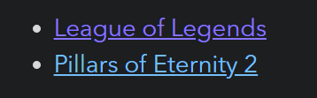
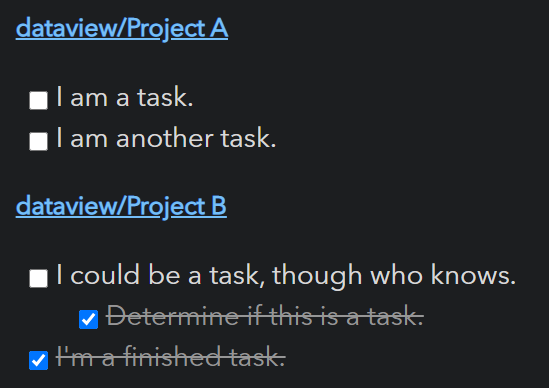

# Obsidian Dataview

Treat your [Obsidian Vault](https://obsidian.md/) as a database which you can query from. Provides a JavaScript API and
pipeline-based query language for filtering, sorting, and extracting data from Markdown pages. See the Examples section
below for some quick examples, or the full [reference](https://blacksmithgu.github.io/obsidian-dataview/) for all the details.

## Examples

Show all games in the game folder, sorted by rating, with some metadata:

~~~markdown
```dataview
table time-played, length, rating
from "games"
sort rating desc
```
~~~


---

List games which are MOBAs or CRPGs.

~~~markdown
```dataview
list from #game/moba or #game/crpg
```
~~~



---

List all markdown [tasks](https://blacksmithgu.github.io/obsidian-dataview/data-annotation/#tasks) in un-completed projects:

~~~markdown
```dataview
task from #projects/active
```
~~~



---

Show all files in the `books` folder that you read in 2021, grouped by genre and sorted by rating:

~~~markdown
```dataviewjs
for (let group of dv.pages("#book").where(p => p["time-read"].year == 2021).groupBy(p => p.genre)) {
	dv.header(3, group.key);
	dv.table(["Name", "Time Read", "Rating"],
		group.rows
			.sort(k => k.rating, 'desc')
			.map(k => [k.file.link, k["time-read"], k.rating]))
}
```
~~~


## Usage

For a full description of all features, instructions, and examples, see the [reference](https://blacksmithgu.github.io/obsidian-dataview/). For a more brief outline, let us examine the two major aspects of Dataview: *data* and *querying*.

#### **Data**

Dataview generates *data* from your vault by pulling
information from **Markdown frontmatter** and **Inline fields**.

- Markdown frontmatter is arbitrary YAML enclosed by `---` at the top of a markdown document which can store metadata
  about that document.
- Inline fields are a Dataview feature which allow you to write metadata directly inline in your markdown document via
  `Key:: Value` syntax.

Examples of both are shown below:

```yaml
---
alias: "document"
last-reviewed: 2021-08-17
thoughts:
  rating: 8
  reviewable: false
---
```
```markdown
# Markdown Page

Basic Field:: Value
**Bold Field**:: Nice!
You can also write [field:: inline fields]; multiple [field2:: on the same line].
If you want to hide the (field3:: key), you can do that too.
```

#### **Querying**

Once you've annotated documents and the like with metadata, you can then query it using any of Dataview's four query
modes:

1. **Dataview Query Language (DQL)**: A pipeline-based, vaguely SQL-looking expression language which can support basic
   use cases. See the [documentation](https://blacksmithgu.github.io/obsidian-dataview/query/queries/) for details.

   ~~~markdown
   ```dataview
   TABLE file.name AS "File", rating AS "Rating" FROM #book
   ```
   ~~~

2. **Inline Expressions**: DQL expressions which you can embed directly inside markdown and which will be evaluated in
   preview mode. See the [documentation](https://blacksmithgu.github.io/obsidian-dataview/reference/expressions/) for
   allowable queries.

   ```markdown
   We are on page `= this.file.name`.
   ```

3. **DataviewJS**: A high-powered JavaScript API which gives full access to the Dataview index and some convenient
   rendering utilities. Highly recommended if you know JavaScript, since this is far more powerful than the query
   language. Check the [documentation](https://blacksmithgu.github.io/obsidian-dataview/api/intro/) for more details.

   ~~~markdown
   ```dataviewjs
   dv.taskList(dv.pages().file.tasks.where(t => !t.completed));
   ```
   ~~~

4. **Inline JS Expressions**: The JavaScript equivalent to inline expressions, which allow you to execute arbitrary JS
   inline:

   ~~~markdown
   This page was last modified at `$= dv.current().file.mtime`.
   ~~~

#### JavaScript Queries: Security Note

JavaScript queries are very powerful, but they run at the same level of access as any other Obsidian plugin. This means
they can potentially rewrite, create, or delete files, as well as make network calls. You should generally write
JavaScript queries yourself or use scripts that you understand or that come from reputable sources. Regular Dataview
queries are sandboxed and cannot make negative changes to your vault (in exchange for being much more limited).

## Contributing

Contributions via bug reports, bug fixes, documentation, and general improvements are always welcome. For more major
feature work, make an issue about the feature idea / reach out to me so we can judge feasibility and how best to
implement it.

#### Local Development

The codebase is written in TypeScript and uses `rollup` / `node` for compilation; for a first time set up, all you
should need to do is pull, install, and build:

```console
foo@bar:~$ git clone git@github.com:blacksmithgu/obsidian-dataview.git
foo@bar:~$ cd obsidian-dataview
foo@bar:~/obsidian-dataview$ npm install
foo@bar:~/obsidian-dataview$ npm run dev
```

This will install libraries, build dataview, and deploy it to `test-vault`, which you can then open in Obsidian. This
will also put `rollup` in watch mode, so any changes to the code will be re-compiled and the test vault will automatically
reload itself.

#### Preparing for creating pull requests

If you plan on doing pull request, we would also recommend to do the following in advance of creating the pull request:

```console
foo@bar:~$ npm run dev
foo@bar:~$ npm run check-format
foo@bar:~$ npm run format
foo@bar:~$ npm run test
```

The third step of `npm run format` is only needed if the format check reports some issue.

#### Installing to Other Vaults

If you want to dogfood dataview in your real vault, you can build and install manually. Dataview is predominantly a
read-only store, so this should be safe, but watch out if you are adjusting functionality that performs file edits!

```console
foo@bar:~/obsidian-dataview$ npm run build
foo@bar:~/obsidian-dataview$ ./scripts/install-built path/to/your/vault
```

#### Building Documentation

We use `MkDocs` for documentation (found in `docs/`). You'll need to have python and pip to run it locally:

```console
foo@bar:~/obsidian-dataview$ pip3 install mkdocs mkdocs-material mkdocs-redirects
foo@bar:~/obsidian-dataview$ cd docs
foo@bar:~/obsidian-dataview/docs$ mkdocs serve
```

This will start a local web server rendering the documentation in `docs/docs`, which will live-reload on change.
Documentation changes are automatically pushed to `blacksmithgu.github.io/obsidian-dataview` once they are merged
to the main branch.

#### Using Dataview Types In Your Own Plugin

Dataview publishes TypeScript typings for all of its APIs onto NPM (as `blacksmithgu/obsidian-dataview`). For
instructions on how to set up development using Dataview, see [setup instructions](https://blacksmithgu.github.io/obsidian-dataview/plugin/develop-against-dataview/).

## Support

Have you found the Dataview plugin helpful, and want to support it? I accept donations which go towards future
development efforts. I generally do not accept payment for bug bounties/feature requests, as financial incentives add
stress/expectations which I want to avoid for a hobby project!

Support @blacksmithgu:  
[](https://www.paypal.com/donate?business=Y9SKV24R5A8BQ&item_name=Open+source+software+development&currency_code=USD)

Support @holroy:  
<a href="https://www.buymeacoffee.com/holroy" target="_blank"></a>
