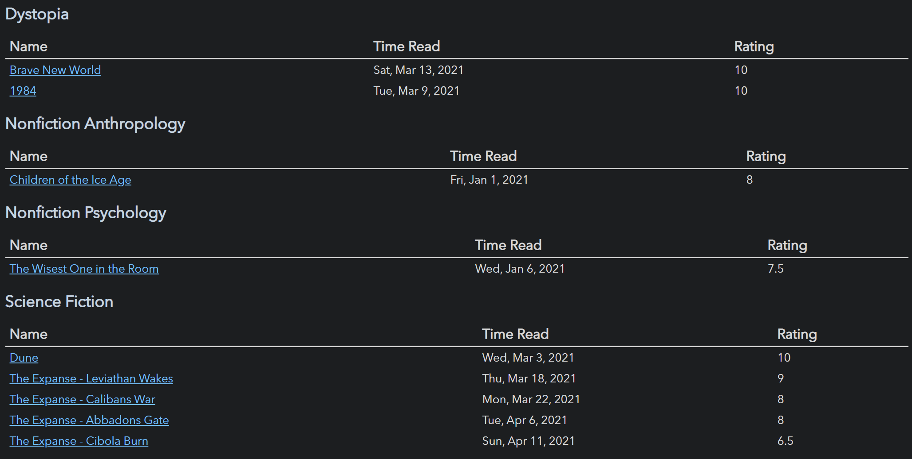

# Codeblock Examples

## Grouped Books

Group your books by genre, then create a table for each sorted by rating via a straightforward usage of
the dataview rendering API:

```js
for (let group of dv.pages("#book").groupBy(p => p.genre)) {
	dv.header(3, group.key);
	dv.table(["Name", "Time Read", "Rating"],
		group.rows
			.sort(k => k.rating, 'desc')
			.map(k => [k.file.link, k["time-read"], k.rating]))
}
```



## Find All Direct And Indirectly Linked Pages

Use a simple set + stack depth first search to find all notes linked to the current note, or a note of your choosing:

```js
let page = dv.current().file.path;
let pages = new Set();

let stack = [page];
while (stack.length > 0) {
	let elem = stack.pop();
	let meta = dv.page(elem);
	if (!meta) continue;

	for (let inlink of meta.file.inlinks.concat(meta.file.outlinks).array()) {
		console.log(inlink);
		if (pages.has(inlink.path)) continue;
		pages.add(inlink.path);
		stack.push(inlink.path);
	}
}

// Data is now the file metadata for every page that directly OR indirectly links to the current page.
let data = dv.array(Array.from(pages)).map(p => dv.page(p));
```
