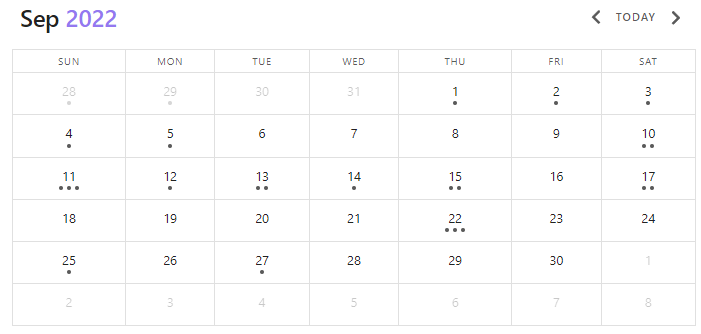

# Query Types

The **Query Type** determines how the output of your dataview query looks like. It is the **first and only mandatory** specification you give to a dataview query. There are four available: `LIST`, `TABLE`, `TASK` and `CALENDAR`.

The Query Type also determines which **information level** a query is executed on. `LIST`, `TABLE` and `CALENDAR` operate at **page level** whereas `TASK` queries operate at the `file.tasks` level. More on that in the `TASK` Query Type.

You can combine **every Query Type with all available [Data Commands](data-commands.md)** to refine your result set. Read more about the interconnection between Query Types and Data Commands on [How to Use Dataview](../index.md#how-to-use-dataview) and the [structure page](structure.md).

!!! summary "Query Type"
    The Query Type determines the output format of a query. It's the only mandatory information for a query.

## LIST

`LIST` queries output a bullet point list consisting of your file links or the group name, if you decided to [group](data-commands.md#group-by). You can specify up to **one additional information** to output alongside your file or group information.

!!! summary "Query Type `LIST`"
    `LIST` outputs a bullet point list of page links or Group keys. You can specify one additional information to show for each result.

The simplest LIST query outputs a bullet point list of all files in your vault:

~~~
```dataview
LIST
```
~~~

**Output**


- [Classic Cheesecake](#)
- [Git Basics](#)
- [How to fix Git Cheatsheet](#)
- [League of Legends](#)
- [Pillars of Eternity 2](#)
- [Stardew Valley](#)
- [Dashboard](#)


but you can, of course, use [data commands](data-commands.md) to restrict which pages you want to have listed:

~~~
```dataview
LIST
FROM #games/mobas OR #games/crpg
```
~~~

**Output**

- [League of Legends](#)
- [Pillars of Eternity 2](#)

### Output an additional information

To add a **additional information** to your query, specify it right after the `LIST` command and before possibly available data commands:

~~~
```dataview
LIST file.folder
```
~~~

**Output**


- [Classic Cheesecake](#): Baking/Recipes
- [Git Basics](#): Coding
- [How to fix Git Cheatsheet](#): Coding/Cheatsheets
- [League of Legends](#): Games
- [Pillars of Eternity 2](#): Games
- [Stardew Valley](#): Games/finished
- [Dashboard](#):

You can only add **one** additional information, not multiple. But you can **specify a computed value** instead of a plain meta data field, which can contain information of multiple fields:

~~~
```dataview
LIST "File Path: " + file.folder + " _(created: " + file.cday + ")_"
FROM "Games"
```
~~~

**Output**

- [League of Legends](#): File Path: Games _(created: May 13, 2021)_
- [Pillars of Eternity 2](#): File Path: Games _(created: February 02, 2022)_
- [Stardew Valley](#): File Path: Games/finished _(created: April 04, 2021)_

### Grouping

A **grouped list** shows their group keys, and only the group keys, by default:

~~~
```dataview
LIST
GROUP BY type
```
~~~

**Output**

- game
- knowledge
- moc
- recipe
- summary

A common use-case on grouped `LIST` queries is to add the file links to the output by specifying them as the additional information:

~~~
```dataview
LIST rows.file.link
GROUP BY type
```
~~~

- game:
    - [Stardew Valley](#)
    - [League of Legends](#)
    - [Pillars of Eternity 2](#)
- knowledge:
    - [Git Basics](#)
- moc:
    - [Dashboard](#)
- recipe:
    - [Classic Cheesecake](#)
- summary:
    - [How to fix Git Cheatsheet](#)

### LIST WITHOUT ID

If you don't want the file name or group key included in the list view, you can use `LIST WITHOUT ID`. `LIST WITHOUT ID` works the same as `LIST`, but it does not output the file link or group name if you add an additional information.

~~~
```dataview
LIST WITHOUT ID
```
~~~

**Output**


- [Classic Cheesecake](#)
- [Git Basics](#)
- [How to fix Git Cheatsheet](#)
- [League of Legends](#)
- [Pillars of Eternity 2](#)
- [Stardew Valley](#)
- [Dashboard](#)

It's the same as `LIST`, because it does not contain an additional information!

~~~
```dataview
LIST WITHOUT ID type
```
~~~

**Output**

- moc
- recipe
- summary
- knowledge
- game
- game
- game

`LIST WITHOUT ID` can be handy if you want to output computed values, for example.

~~~
```dataview
LIST WITHOUT ID length(rows) + " pages of type " + key
GROUP BY type
```
~~~

**Output**

- 3 pages of type game
- 1 pages of type knowledge
- 1 pages of type moc
- 1 pages of type recipe
- 1 pages of type summary

## TABLE

The `TABLE` query types outputs page data as a tabular view. You can add zero to multiple meta data fields to your `TABLE` query by adding them as a **comma separated list**. You can not only use plain meta data fields as columns, but specify **calculations** as well. Optionally, you can specify a **table header** via the `AS <header>` syntax. Like all other query types, you can refine your result set for your query with [data commands](data-commands.md).

!!! summary "`TABLE` Query Type"
    `TABLE` queries render a tabular view of any number of meta data values or calculations. It is possible to specify column headers via `AS <header>`.

~~~
```dataview
TABLE
```
~~~

**Output**

| File (7) |
| ----- |
| [Classic Cheesecake](#) |
| [Git Basics](#) |
| [How to fix Git Cheatsheet](#) |
| [League of Legends](#) |
| [Pillars of Eternity 2](#) |
| [Stardew Valley](#) |
| [Dashboard](#) |

!!! hint "Changing the first column header name"
    You can change the name of the first column header (by default "File" or "Group") via the Dataview Settings under Table Settings -> Primary Column Name / Group Column Name.
    If you want to change the name only for one specific `TABLE` query, have a look at `TABLE WITHOUT ID`.

!!! info "Disabling Result count"
    The first column always shows the result count. If you do not want to get it displayed, you can disable it in Dataview's settings ("Display result count", available since 0.5.52).

Of course, a `TABLE` is made for specifying one to multiple additional information:

~~~
```dataview
TABLE started, file.folder, file.etags
FROM #games
```
~~~

**Output**

| File (3) | started | file.folder | file.etags |
| --- | --- | --- | --- |
| [League of Legends](#)  | 	May 16, 2021 | 	Games	 | - #games/moba  |
| [Pillars of Eternity 2](#)  | 	April 21, 2022 | 	Games	 | - #games/crpg |
| [Stardew Valley](#) | 	April 04, 2021 | 	Games/finished	 |  - #games/simulation |

!!! hint "Implicit fields"
    Curious about `file.folder` and `file.etags`? Learn more about [implicit fields on pages](../annotation/metadata-pages.md).

### Custom Column Headers

You can specify **custom headings** for your columns by using the `AS` syntax:

~~~
```dataview
TABLE started, file.folder AS Path, file.etags AS "File Tags"
FROM #games
```
~~~

**Output**

| File (3) | started | Path | File Tags |
| --- | --- | --- | --- |
| [League of Legends](#) | 	May 16, 2021 | 	Games	 | - #games/moba  |
| [Pillars of Eternity 2](#)  | 	April 21, 2022 | 	Games	 | - #games/crpg |
| [Stardew Valley](#) | 	April 04, 2021 | 	Games/finished	 |  - #games/simulation |

!!! info "Custom headers with spaces"
    If you want to use a custom header with spaces, like `File Tags`, you need to wrap it into double quotes: `"File Tags"`.

This is especially useful when you want to use **calculations or expressions as column values**:

~~~
```dataview
TABLE
default(finished, date(today)) - started AS "Played for",
file.folder AS Path,
file.etags AS "File Tags"
FROM #games
```
~~~

**Output**

| File (3) | Played for | Path | File Tags |
| --- | --- | --- | --- |
| [League of Legends](#) | 	1 years, 6 months, 1 weeks | 	Games	 | - #games/moba  |
| [Pillars of Eternity 2](#)  | 	7 months, 2 days | 	Games	 | - #games/crpg |
| [Stardew Valley](#) | 	4 months, 3 weeks, 3 days | 	Games/finished	 |  - #games/simulation |

!!! hint "Calculations and expressions"
    Learn more about the capability of computing expressions and calculations under [expressions](../reference/expressions.md) and [functions](../reference/functions.md).

### TABLE WITHOUT ID

If you don't want the first column ("File" or "Group" by default), you can use `TABLE WITHOUT ID`. `TABLE WITHOUT ID` works the same as `TABLE`, but it does not output the file link or group name as a first column if you add additional information.

You can use this if you, for example, output another identifying value:

~~~
```dataview
TABLE WITHOUT ID
steamid,
file.etags AS "File Tags"
FROM #games
```
~~~

**Output**

| steamid (3)  | File Tags |
| --- | --- |
| 560130 |  - #games/crog  |
| - |  - #games/moba |
| 413150 |   - #games/simulation |

Also, you can use `TABLE WITHOUT ID` if you want to **rename the first column for one specific query**.

~~~
```dataview
TABLE WITHOUT ID
file.link AS "Game",
file.etags AS "File Tags"
FROM #games
```
~~~

**Output**

| Game (3) | File Tags |
| --- | --- |
| [League of Legends](#) |  - #games/moba  |
| [Pillars of Eternity 2](#)  | - #games/crpg |
| [Stardew Valley](#) |  - #games/simulation |

!!! info "Renaming the first column in general"
    If you want to rename the first column in all cases, change the name in Dataviews settings under Table Settings.

## TASK

The `TASK` Query outputs **an interactive list of all tasks in your vault** that match the given [data commands](data-commands.md) (if any). `TASK` queries are special compared to the other Query Types because they do give back **Tasks as results and not pages**. This implies that all [data commands](data-commands.md) operate on **Task level** and makes it possible to granularly filter your tasks i.e. for their status or meta data specified on the task itself.

Also, `TASK` Queries are the only possibility to **manipulate your files through DQL**. Normally, Dataview does not touch the content of your files; however, if you check a task through a dataview query, it'll get **checked in its original file, too**. In the Dataview Settings under "Task Settings", you can opt-in to automatically set a `completion` meta data field when checking a task in dataview. Mind though that this only works if you check the task inside a dataview block.

!!! summary "`TASK` Query Type"
    `TASK` queries render an interactive list of all tasks in your vault. `TASK` Queries are executed on **task level**, not page level, allowing for task-specific filtering. This is the only command in dataview that modifies your original files if interacted with.

~~~
```dataview
TASK
```
~~~

**Output**

- [ ] Buy new shoes #shopping
- [ ] Mail Paul about training schedule
- [ ] Finish the math assignment
    - [x] Finish Paper 1 [due:: 2022-08-13]
    - [ ] Read again through chapter 3 [due:: 2022-09-01]
    - [x] Write a cheatsheet [due:: 2022-08-02]
    - [ ] Write a summary of chapter 1-4 [due:: 2022-09-12]
- [x] Hand in physics
- [ ] Get new pillows for mom #shopping
- [x] Buy some working pencils #shopping

You can use [data commands](data-commands.md) like for all other Query Types. Data Commands are executed on task level, making [implicit fields on tasks](../annotation/metadata-tasks.md) directly available.

~~~
```dataview
TASK
WHERE !completed AND contains(tags, "#shopping")
```
~~~

**Output**

- [ ] Buy new shoes #shopping
- [ ] Get new pillows for mom #shopping

A common use case for tasks is to **group tasks by their originating file**:

~~~
```dataview
TASK
WHERE !completed
GROUP BY file.link
```
~~~

**Output**

[2022-07-30](#) (1)

- [ ] Finish the math assignment
    - [ ] Read again through chapter 3 [due:: 2022-09-01]
    - [ ] Write a summary of chapter 1-4 [due:: 2022-09-12]

[2022-09-21](#) (2)

- [ ] Buy new shoes #shopping
- [ ] Mail Paul about training schedule

[2022-09-27](#) (1)

- [ ] Get new pillows for mom #shopping

!!! hint "Counting tasks with subtask"
    Noticing the (1) on the header of `2022-07-30`? Child tasks belong to their parent task and are not counted separately. Also, they **behave differently** on filtering.

### Child Tasks

A task is considered a **child task** if it is **indented by a tab** and is below an unindented task.

- [ ] clean up the house
	- [ ] kitchen
	- [x] living room
	- [ ] Bedroom [urgent:: true]


!!! info "Children of a bullet point item"
    While indented tasks under a bulleted list item are, strictly speaking, also child tasks, Dataview will handle them like normal tasks in most cases.

Child Tasks **belong to their parent**. This means if you're querying for tasks, you'll get child tasks as part of their parent back.

~~~
```dataview
TASK
```
~~~

**Output**

- [ ] clean up the house
	- [ ] kitchen
	- [x] living room
	- [ ] Bedroom [urgent:: true]
- [ ] Call the insurance about the car
- [x] Find out the transaction number

This specifically means that child task will be part of your result set **as long as the parent matches the query** - even if the child task itself doesn't.

~~~
```dataview
TASK
WHERE !completed
```
~~~

**Output**

- [ ] clean up the house
	- [ ] kitchen
	- [x] living room
	- [ ] Bedroom [urgent:: true]
- [ ] Call the insurance about the car

Here, `living room` does **not match** the query, but is included anyway, because its parent `clean up the house` does match.

Mind that you'll get individual children tasks back, if the child matches your predicate but the parent doesn't:

~~~
```dataview
TASK
WHERE urgent
```
~~~

**Output**

- [ ] Bedroom [urgent:: true]

## CALENDAR

The `CALENDAR` Query outputs a monthly based calendar where every result is depicted as a dot on it referring date. The `CALENDAR` is the only Query Type that requires an additional information. This additional information needs to be a [date](../annotation/types-of-metadata.md#date) (or unset) on all queried pages.

!!! summary "`CALENDAR` Query Type"
    The `CALENDAR` Query Types renders a calendar view where every result is represented by a dot on the given meta data field date.


~~~
```dataview
CALENDAR file.ctime
```
~~~

**Output**



While it is possible to use `SORT` and `GROUP BY` in combination with `CALENDAR`, it has **no effect**. Additionally, the calendar query does not render if the given meta data field contains something else than a valid [date](../annotation/types-of-metadata.md#date) (but the field can be empty). To make sure you're only taking valid pages into account, you can filter for valid meta data values:

~~~
```dataview
CALENDAR due
WHERE typeof(due) = "date"
```
~~~
