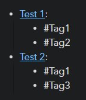
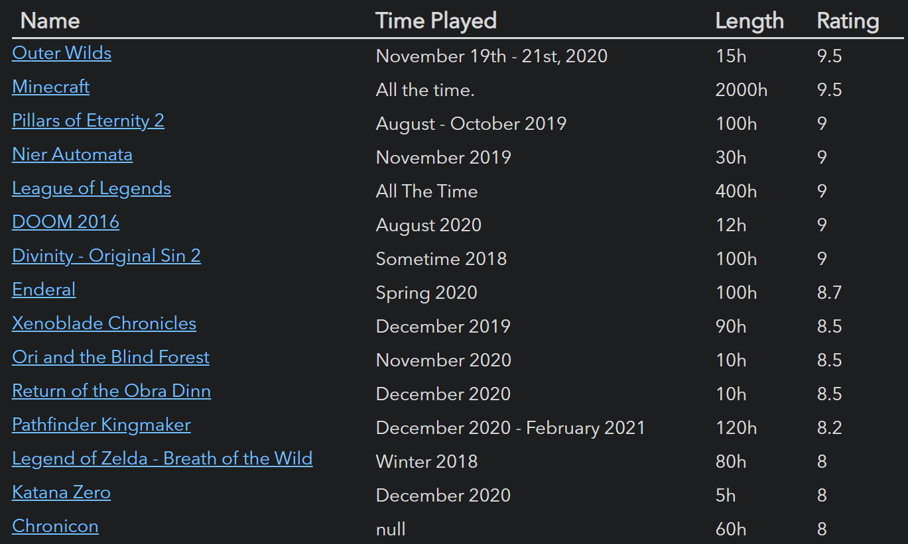

# Queries

The core of Dataview is the query, which describes what data should be collected, how it should be transformed, and how it should be presented. 

Queries take the general form:

~~~
```dataview
[TABLE|LIST|TASK] field1, field2, ..., fieldN FROM #tag or "folder" or [[link]]
WHERE somefield = somevalue
COMMAND argument
COMMAND argument
...
COMMAND argument
```
~~~

Only the select statement (the `TABLE/LIST/TASK` block which defines **what**
to render) is required. If the `FROM` statement is excluded, it implicitly
fetches all pages. Queries are executed by fetching all of the data from the
source described by the FROM block, and then applying all of the commands
(like `WHERE`, `SORT`, etc) **in order**.

Fields are selected from the YAML frontmatter of markdown pages, as well as
special dataview fields (generally of the form `file.<field>`). For more
details, see [Fields](fields.md).

The various commands, including the different query types and the `FROM`
block, are described below.

---

# Query Types

There are currently three query types in Dataview, corresponding to three different view types: Lists, Tables, and Task views.

#### Lists

Lists are the simplest view, and simply render a list of pages (or custom fields) which match the query. 
To obtain a list of pages matching the query, simply use:

```
LIST FROM <source>
```

<p align="center">
    
</p>

You can render YAML frontmatter fields or special computed fields (like `file.path`) using the format syntax. 
You can also concatenate strings to the result using the `+` operator:

```
LIST "File Path: " + file.path FROM "4. Archive"
```

<p align="center">
    
</p>

You can also render an indented list of fields with multiple values. 
For example, show an indented list of all tags in a note:

```
list file.tags from <source>
```

<p align="center">
    
</p>

#### Tables

Tables support tabular views of page data. You construct a table by giving a comma separated list of the YAML frontmatter fields you want to render, as so:

```
TABLE file.day, file.mtime FROM <source>
```

You can choose a heading name to render computed fields by using the `AS` syntax:

```
TABLE (file.mtime + dur(1 day)) AS next_mtime, ... FROM <source>
```

<p align="center">
    
</p>

#### Tasks

Task views render all tasks whose pages match the given predicate.

```
TASK from "dataview"
```

<p align="center">
    
</p>

---

# Data Commands

The different commands that dataview queries can be made up of. Commands are executed in order, and you can have duplicate commands (so multiple `WHERE` blocks or multiple `GROUP BY` blocks, for example).

## FROM (Sources)

The `FROM` statement determines what pages will initially be collected and passed onto the other commands for further filtering. 
You can select pages by folder, by tag, or by incoming/outgoing links.

- **Tags**: To select from a tag (and all its subtags), use `FROM #tag`.
- **Folders**: To select from a folder (and all its subfolders), use `FROM "folder"`.
- **Links**: You can either select links TO a file, or all links FROM a file. 
  - To obtain all pages which link TO `[[note]]`, use `FROM [[note]]`. 
  - To obtain all pages which link FROM `[[note]]` (i.e., all the links in that file), use `FROM outgoing([[note]])`.

You can compose these filters in order to get more advanced sources using `and` and `or`. 
- For example, `#tag and "folder"` will return all pages in `folder` and with `#tag`. 
- `[[Food]] or [[Exercise]]` will give any pages which link to `[[Food]]` OR `[[Exercise]]`.

## WHERE

The `WHERE` statement allows filtering pages on YAML fields and custom fields. Only pages where the clause evaluates to `true` will be yielded.

```
WHERE <clause>
```

#### Examples

Obtain all files which were modified in the last 24 hours:

```
LIST FROM ""
WHERE file.mtime >= date(today) - dur(1 day)
```

Find all projects which are not marked complete and are more than a month old:

```
LIST FROM #projects
WHERE !completed AND file.ctime <= date(today) - dur(1 month)
```

## SORT

Sorts all results by one or more fields.

```
SORT date [ASCENDING/DESCENDING/ASC/DESC]
```

You can also give multiple fields to sort by. Sorting will be done based on the first field. Then, if a tie occurs, the second field will be used to sort the tied fields. If there is still a tie, the third sort will resolve it, and so on.

```
SORT field1 [ASCENDING/DESCENDING/ASC/DESC], ..., fieldN [ASC/DESC]
```

## GROUP BY

Group all results on a field. Yields one row per unique field value, which has 2 properties: one corresponding to the field being grouped on, and a `rows` array field which contains all of the pages that matched.

```
GROUP BY field
GROUP BY (computed_field) AS name
```

In order to make working with the `rows` array easier, Dataview supports field "swizzling". If you want the field `test` from every object in the `rows` array, then `rows.test` will automatically fetch the `test` field from every object in `rows`, yielding a new array. 
You can then apply aggregation operators like `sum()` over the resulting array.

## FLATTEN

Flatten an array in every row, yielding one result row per entry in the array.

```
FLATTEN field
FLATTEN (computed_field) AS name
```

For example, flatten the `authors` field in each literature note to give one row per author:

```
table authors from #LiteratureNote
flatten authors
```

<p align="center">
    
</p>